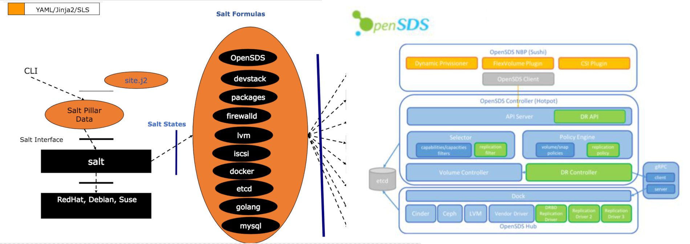

# Deploying OpenSDS with Salt

Provision one or more GNU/Linux hosts so we can deploy OpenSDS.

Architectural View
===================

<a href="https://github.com/opensds/opensds"></a>

Vagrant Setup
=============
Allow minimum of 2GB+2CPU for virutalized host (12GB+6CPU is verified).
```
Download https://www.virtualbox.org/wiki/Downloads
Download https://www.vagrantup.com/downloads.html
 mkdir ~/vagrant && cd ~/vagrant
```
Choose Linux Image
```
 vagrant init generic/ubuntu1804    #UBUNTU

 vagrant init geerlingguy/centos7   #CENTOS
```
Configure Vagrantfile with public network, and sufficient cpu/ram resources.
```
 vi Vagrantfile

   config.vm.provider "virtualbox" do |vb|
     vb.memory = "12127"
     vb.cpus = 6
   end
   config.vm.network "public_network"

 vagrant up            # select 'bridge' or 'internet' interface
 vagrant ssh 
```

On CentOS install git
```
 yum install git -y
```

OpenSDS deployed with Salt
==========================
The duration of this procedure ranges from 20 to 35 minutes.

```
 sudo -s
 rm -fr /srv/formulas/* /root/opensds-installer
 cd /root && git clone https://github.com/opensds/opensds-installer.git
 cd opensds-installer/salt
```

Review site details applying to the installation. Use caution when making edits to syntax errors breaking solution.
```
 vi site.j2
```

Deploy OpenSDS
```
 ./install.sh -i salt
```
UBUNTU
```
 ./install.sh -i opensds
```
CENTOS (repeat command twice due to upstream openstack-devstack bug)
```
 ./install.sh -i opensds;./install.sh -i opensds
```

Review example output
=====================

```
 ./install.sh -i salt
  ... etc ...
Summary for local
-------------
Succeeded: 32 (changed=27)
Failed:     0
-------------
Total states run:     32
Total run time:   65.047 s
Accepted Keys:
ubuntu1804.localdomain
Denied Keys:
Unaccepted Keys:
Rejected Keys:
done
  ... etc ...


Summary for local
-------------
Succeeded: 24 (changed=10)
Failed:     0
-------------
Total states run:     24
Total run time:  145.313 s


 ./install.sh -i opensds
prepare salt ...
run salt ...
local:
    ----------
    base:
        - opensds
 ... please be patient ...


  ... etc ...
Summary for local
--------------
Succeeded: 249 (changed=157)
Failed:      0
--------------
Total states run:     249
Total run time:  2643.544 s
local:
    ----------
    opensds:
        - default
```

How to test opensds cluster
===========================

Ensure openSDS services are running
```
 ps -ef | grep 'osds'
 sudo docker ps -a
 systemctl list-unit-files | grep opensds
 systemctl status opensds-<name>
```

Firstly configure opensds CLI tool:
```
 sudo cp /opt/opensds-linux-amd64/bin/osds* /usr/bin
 export OPENSDS_AUTH_STRATEGY=noauth
 export OPENSDS_ENDPOINT=http://<primary_host_ip>:50040
```
Check if the pool resource is avaibable
```
 osdsctl pool list
```

Then create a default profile:
```
 osdsctl profile create '{"name": "default", "description": "default policy"}'
```

Create a volume:
```
 osdsctl volume create 1 --name=test-001
```

List all volumes:
```
 osdsctl volume list
```

Delete the volume:
```
 osdsctl volume delete <your_volume_id>
```

### Dashboard
The OpenSDS dashboard is available at http://{your_host_ip}:8088, please login the dashboard using the default admin credentials: admin/opensds@123. Create tenant, user, and profiles as admin. Multi-Cloud is also supported by dashboard.  

Logout of the dashboard as admin and login the dashboard again as a non-admin user to create volume, snapshot, expand volume, create volume from snapshot, create volume group.


How to purge and clean opensds cluster
========================================
```
 sudo /root/opensds-installer/salt/install.sh -r opensds
```
